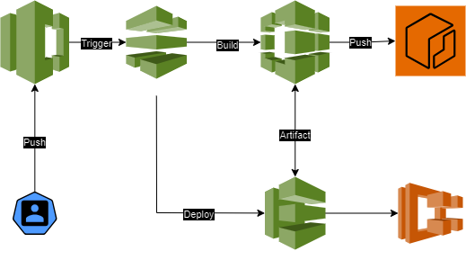

# AWS CodeCommit in Simple English: Build & Push Docker Container


## This tutorial explains how AWS CodeCommit works and builds, and pushes Docker Image to ECS as a Pipeline.

### INTRODUCTION

AWS CodeCommit is a service that delivers a complete DevOps Package starting with a version control repository and ending with continuous integration / continuous deployment workflow through the other three services that build/compile the application's code and deploy it to production.

#### Explaining in Detail:

AWS CodeCommit service mainly includes four stages in which each stage represents an independent service that is integrated together to create a CI/CD workflow:

1. CodeCommit(Optional - if other git repository used): 
A Git repository that stores and controls the application's files that would be compiled and deployed.
2. AWS Artifact(optional):
3. AWS CodeBuild(Optional - if application doesn't require compiling - eg. S3 files): 
It builds the application stored in CodeCommit under a set of steps coded in a .yaml formatted file called "Buildspec.yaml". This is similar to the "Jenkinsfile" in Jenkins, GitHub Actions Template files, and other CICD platform workflow files.

4. CodeDeploy(Optional): This would deploy the compiled code in CodeBuild or the file stored in your repo to one of the AWS services- eg. EC2, ECS, and S3..etc
5. AWS Pipeline: This would run an automated workflow using one or all of the previous stages whenever an event occurs to the repository in CodeCommit, or other repo platforms like GitHub, GitLab, or Bitbucket.. Etc.

### Project Demonstration

I used the same steps in the [Jenkins project](https://github.com/obreo/Jenkins-to-ECS-ECR-Pipeline) with the same app in this example.

#### Prerequisites:

1. AWS Account
2. IAM user with git credentials (for security reasons, it is better to create a separate user for this purpose).
3. AWS Codebuild Role: that authenticates AWS ECR. 
4. AWS CodeDeploy Role(automatically created by the service): that authenticates to AWS ECS.
5. Git installed on your machine.
6. AWS ECR repository
7. AWS ECS task, service, and cluster

### Steps

#### Creating IAM Account:

1. Create a new user from IAM and attach CodeCommit Full Access Policy.
2. From the Credentials section, create Git credentials and download them as we'll use them when we push our app to the repo.
#### AWS CodeCommit Setup:

1. Using your main account, browse AWS CodeCommit from the dashboard.
2. From the Navigation bar at the left, click on CodeCommit and create a new repo.
3. Following the written instructions in the AWS CodeCommit Dashboard, copy the git repository and clone it with git:

```

git clone https://REPO_URL.git

```

4. A New Folder will be created that represents the cloned repository files. Copy your application files to the folder created. Then push the files:

```

git add .
git commit -m "Updated"
git push

```

A window will pop up and ask for signing in, add the git credentials downloaded from AWS IAM.

Now all the files should be available in the CodeCommit repository.

#### CodeBuild Setup:

1. From AWS CodeCommit Service navigation bar, browse to CodeBuild and create a new build
2. Here you'll set up the configuration of the compute machine that will compile the code, whether using EC2 or ECS image. 
3. Check the privileged option so the ECS images deployed by AWS include the Docker engine to build & push images which is what we need. 

I chose Ubuntu with ECS for deployment.

4. To code the Buildspec.yaml file, we have to understand it:

I'll divide the Buildspec file code into two parts, the configuration part, and the building part.

**CONFIGURATION**

1. Version: the version of the Buildspec format.
2. Env: This is used to run environment variables.
3. Batch: It allows you to configure settings related to batch builds.
4. Reports: Generate reports during the build process.
5. Artifacts: It lets you specify which files generated during the build should be stored as artifacts. This file can be used for reference to deploy your app.
6. Cache: This section allows you to specify paths for caching to speed up the building process.

**BUILDING**

There are three stages of building but they all can be done with one stage only. At the same time, it is a good practice to organize the workflow with all the stages.
1. PreBuilding: This represents any step required before building the app. Such as installing a runner, accessing a repo as we'd do with logging into AWS ECR, etc...
2. Build: This is where the code would be compiled. Includes all the commands required to make it ready.
3. PostBuild: This is used for taking an action once an app is compiled, such as reporting or clearing the process when done or maybe uploading the file to some service.

```

version: 0.2

#env:
  #variables:
     # key: "value"
     # key: "value"
  #parameter-store:
     # key: "value"
     # key: "value"
  #secrets-manager:
     # key: secret-id:json-key:version-stage:version-id
     # key: secret-id:json-key:version-stage:version-id
  #exported-variables:
     # - variable
     # - variable
  #git-credential-helper: yes
#batch:
  #fast-fail: true
  #build-list:
  #build-matrix:
  #build-graph:
phases:
  #install:
    #runtime-versions:
      # name: version
      # name: version
    #commands:
      # - command
      # - command
  #pre_build:
    #commands:
      # - command
      # - command
  build:
    commands:
      # - command
      # - command
  #post_build:
    #commands:
      # - command
      # - command
#reports:
  #report-name-or-arn:
    #files:
      # - location
      # - location
    #base-directory: location
    #discard-paths: yes
    #file-format: JunitXml | CucumberJson
#artifacts:
  #files:
    # - location
    # - location
  #name: $(date +%Y-%m-%d)
  #discard-paths: yes
  #base-directory: location
#cache:
  #paths:
    # - paths

```

Our script would build the docker image, and then push it to the AWS ECR repository:

```

version: 0.2

env:
  variables:
    REPO_URI: "ECR_REPOSITORY_URI"
    IMAGE_NAME: ""
    REGION: "us-east-1"
    ecsService: "ECS_SERVICE_NAME"
    ecsCluster: "ECS_CLUSTER_NAME"
    taskDefinition: "TASK_DEFINITION_NAME"

phases:
  pre_build:
    commands:
      - echo Logging in AWS ECR...
      - aws ecr get-login-password --region $REGION | docker login --username AWS --password-stdin $REPO_URI

  build:
    commands:
      - echo Building Docker Image...
      - docker build -t $IMAGE_NAME:latest .
      - docker tag $IMAGE_NAME:latest $REPO_URI/$IMAGE_NAME:latest

  post_build:
    commands:
      - echo Pushing Docker Image to ECR Repo...
      - docker push $REPO_URI/$IMAGE_NAME:latest

artifacts:
  files: imagedefinitions.json #This will build a task definition file (optional)

```

**Here is how an Artifact is written:**

```
[
    {
      "name": "NAME_OF_CONTAINER",
      "imageUri": "IMAGE_URI_IN_ECR",
      "memory": 512,   // The amount of memory (in MiB) to allocate to the container
      "CPU": 256,      // The amount of CPU units to allocate to the container
      "essential": true,  // Set to true if this container is essential for the task
      
      "portMappings": [
        {
        "containerPort": 80,  // The port on which your container listens
        "hostPort": 80        // The port on the host instance to map to
        }
      ],
      
      "environment": [
      {
        "name": "ENV_VARIABLE_NAME",
        "value": "ENV_VARIABLE_VALUE"
      }
    ]
  }
]
  
```


#### AWS CodeDeploy Setup

This would deploy the app we built in CodeBuild using the artifact file to an ECS Cluster. Alternatively, you can choose an artifact file from your repository using the SourceArtifact. 

On the other hand, you can skip this option and rely on codeBuild alone by adding an extra step to update the service with the new task update:

```
aws ecs update-service --region us-east-1 --service $ecsService --cluster $ecsCluster --task-definition $taskDefinition
```

But we'd skip this to the Pipeline which has more user-friendly CodeDeploy configurations. 

#### AWS Pipeline

1. From the AWS CodeCommit dashboard, browse to Pipelines in the navigation bar. 
2. Configure the service settings then continue.
3. There are three stages to be assigned. we'll choose the same configurations we prepared in each stage; CodeCommit for the source stage, CodeBuild for the building stage, and CodeDeploy for the deployment stage.
4. For the deployment: Configure the service settings by choosing ECS, and specify the SourceArtifact(if stored in the repo) or BuildArtifact (the one codeBuild exported).

**Once done, start the build and it shall work. If any error occurs, read the Logs and troubleshoot**.

### Alternatively

1. Create a pipeline between the code-commit repository and Build only, where CodeBuild will include the command that updates the ECS service as mentioned before.
2. Skip the Deploy process.
3. Make sure the Build has a role to access ECS.
